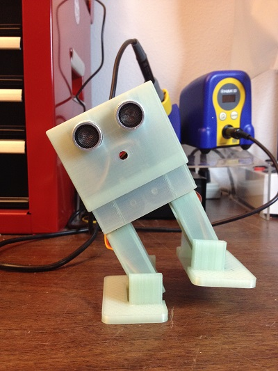
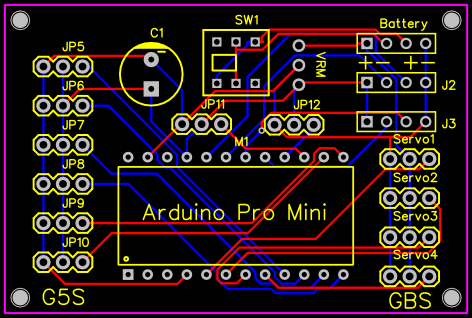

DanceBot
========

This is my adaptation of the Bobwi DanceBot (https://github.com/G4lile0/Bobwi)
inspired by Zowi (http://diwo.bq.com/en/zowi-cc-by-sa/) and is licesed the same
the originals Attribution-ShareAlike 4.0 International (CC BY-SA 4.0)
http://creativecommons.org/licenses/by-sa/4.0/

|

|

My goal was to simplify assembly for use in Workshops at my local Makerspace
https://confluent.space/. A custom PC board using a DFRobot DFRduino Pro Mini
was created to make the electronics assembly easier as well.

|

|

The build instuctions are almost complete but they could use a bit more editing
and a section on calibration.

